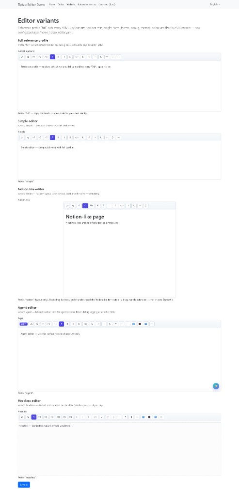

# Tiptap Editor Bundle

[](https://github.com/nowo-tech/TiptapEditorBundle/actions/workflows/ci.yml) [](https://packagist.org/packages/nowo-tech/tiptap-editor-bundle) [](https://packagist.org/packages/nowo-tech/tiptap-editor-bundle) [](LICENSE) [](https://php.net) [](https://symfony.com)

> **Found this useful?** [Install from Packagist](https://packagist.org/packages/nowo-tech/tiptap-editor-bundle) · Star the repo on [GitHub](https://github.com/nowo-tech/TiptapEditorBundle).

**Symfony form type** for rich text using [**Tiptap**](https://tiptap.dev/) (ProseMirror). Stores HTML in the underlying textarea — comparable to embedding **CKEditor-style** WYSIWYG fields. Assets are built with **Vite** (IIFE bundle in `Resources/public/`).

**FrankenPHP worker mode:** Supported for production-style demo runs (worker-enabled Caddyfile). Development demos use classic `php_server` without worker so PHP/Twig changes apply on refresh — see [docs/DEMO-FRANKENPHP.md](docs/DEMO-FRANKENPHP.md).

## Features

- `TiptapEditorType` extending `TextareaType` — value is HTML string.
- Optional formatting toolbar (bold, italic, bullet/ordered lists, undo/redo).
- Twig themes aligned with common Symfony layouts (Bootstrap 3–5, Foundation, Tailwind 2, table layout).
- `nowo_tiptap_editor_asset_path()` Twig helper for `assets:install` paths (`bundles/nowotiptapeditor/`).
- **pnpm + Vite** frontend; **Vitest** on the bundle logger and the widget lifecycle (custom element).
- **Form submit:** before POST, the bundle syncs ProseMirror HTML into each hidden Symfony textarea (capture-phase `submit`); see [Usage](docs/USAGE.md).
- **Dockerfile + Makefile** workflow matching other Nowo bundles.
- **Demos**: Symfony 7 & 8 under `demo/` (FrankenPHP).

## Demo preview

**Editor variants** in the Symfony demo app (profiles from `config/packages/nowo_tiptap_editor.yaml`: full reference, `simple`, `notion`, `agent`, `headless`). Start a demo with `make -C demo up-symfony8` or `make -C demo up-symfony7`, then open the **Variants** route in the browser.



## Quick start

```bash
composer require nowo-tech/tiptap-editor-bundle:^1.0
php bin/console assets:install public
```

In Twig layout:

```twig
<script src="{{ asset(nowo_tiptap_editor_asset_path('tiptap-editor.js')) }}"></script>
```

```php
use Nowo\TiptapEditorBundle\Form\TiptapEditorType;

$builder->add('article', TiptapEditorType::class, ['label' => 'Article']);
```

## Documentation

- [Installation](docs/INSTALLATION.md)
- [Configuration](docs/CONFIGURATION.md)
- [Usage](docs/USAGE.md)
- [Contributing](docs/CONTRIBUTING.md)
- [Changelog](docs/CHANGELOG.md)
- [Upgrading](docs/UPGRADING.md)
- [Release](docs/RELEASE.md)
- [Security](docs/SECURITY.md)
- [Engram](docs/ENGRAM.md)
- [Spec-driven development](docs/SPEC-DRIVEN-DEVELOPMENT.md)
- [GitHub Spec Kit](docs/SPEC-KIT.md)
### Additional documentation

- [Demo with FrankenPHP (development and production)](docs/DEMO-FRANKENPHP.md)

## Development

Requirements: Docker (recommended), or PHP 8.2+ with Composer + pnpm locally.

```bash
make up           # composer + pnpm install in container
make assets       # vite build → src/Resources/public/tiptap-editor.js
make test         # PHPUnit
make test-ts      # Vitest + coverage (logger)
make qa           # cs-check + phpunit
```

Demos:

```bash
make -C demo up-symfony8
# http://localhost:8011
```

## Tests and coverage

| Layer | Target / notes |
| ----- | ---------------- |
| **PHP** | **100%** line coverage on bundle `src/` (PHPUnit); confirm with `composer test-coverage` or `make test-coverage`. |
| **TypeScript** | Vitest thresholds on shared utilities (see `vitest.config.ts`); confirm with `pnpm run test:coverage` or `make test-ts`. |

CI runs PHPUnit (matrix), PHPStan, PHP-CS-Fixer, and Vitest coverage on pushes and pull requests.

## License

MIT — see [LICENSE](LICENSE).
